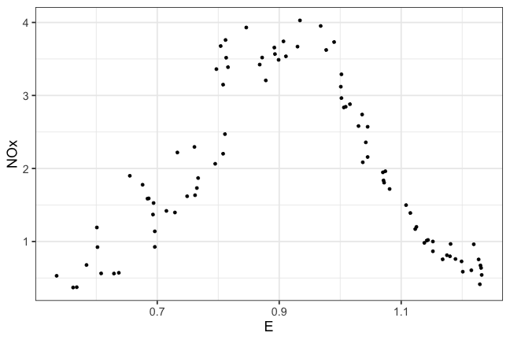

Resampling
========================================================
author: Statistical Learning
date: James Scott (UT-Austin)
autosize: false
font-family: 'Gill Sans'
transition: none

<style>
.small-code pre code {
  font-size: 1em;
}
</style>


Reference: _Introduction to Statistical Learning_ Chapter 5


Resampling methods  
=============

1. Cross-validation (leave-one-out and K-fold)  

2. Nonparametric bootstrap  

3. The residual resampling bootstrap  

4. The parametric bootstrap  


Recall train/test splits
=============  

Goal: estimate the prediction error of a fitted model.  

Solution so far: 
- Randomly split the data into a training set and testing set.  
- Fit the model(s) on the training set.  
- Make predictions on the test set using the fitted model(s).  
- Check how well you did (RMSE, classification error, deviance...)  

A perfectly sensible approach!  But still has some drawbacks...  


Train/test splits: drawbacks  
=============  

Drawback 1: the estimate of the error rate can be highly variable.  
- It depends strongly on which observations end up in the training and testing sets.  
- Can be mitigated by averaging over multiple train/test splits, but this can get computationally expensive.  

Drawback 2: only _some_ of the data points are used to fit the model.  
- Statistical methods tend to perform worse with less data.    
- So the test-set error rate is _biased_: it tends to _overestimate_ the error rate we'd see if we trained on the full data set.  
- This effect is especially strong for complex models.  


Leave-one-out cross validation (LOOCV)
=============  

Key idea: average over all possible testing sets of size $n_{\mathrm{test}} = 1$.  

For i in 1 to N:  
- Fit the model using all data points except $i$.    
- Predict $y_i$ with $\hat{y_i}$, using the fitted model.  
- Calculate the error, $\mathrm{Err}(y_i, \hat{y_i})$.  

Estimate the error rate as:
$$
\mathrm{CV}_{(n)} = \frac{1}{n} \sum_{i=1}^n \mathrm{Err}(y_i, \hat{y_i})
$$


LOOCV: quick example  
=============  
class: small-code


The data in "ethanol.csv" is from an experiment where an ethanol-based fuel was burned in a one-cylinder combustion engine. 
- The experimenter varied the equivalence ratio (E), which measures the richness of the fuel-air mixture in the combustion chamber.  
- For each setting of E, emission of nitrogen oxides (NOx) were recorded.  


LOOCV: quick example  
=============  
class: small-code


```r
library(tidyverse)
ethanol = read.csv('ethanol.csv')
ggplot(ethanol) + geom_point(aes(x=E, y=NOx))  + 
  theme_bw(base_size=18)
```




LOOCV: quick example  
=============  
class: small-code

KNN with $K=5$:

```r
library(FNN)

N = nrow(ethanol)
err_save = rep(0, N)
for(i in 1:N) {
  X_train = ethanol$E[-i]
  y_train = ethanol$NOx[-i]
  X_test = ethanol$E[i]
  y_test = ethanol$NOx[i]
  knn_model = knn.reg(X_train, X_test, y_train, k = 5)
  yhat_test = knn_model$pred
  err_save[i] = (y_test - yhat_test)
}
# RMSE
sqrt(mean(err_save^2))
```

```
[1] 0.3365111
```


LOOCV: quick example  
=============  
class: small-code

Comparison with a 5th degree polynomial:  

```r
N = nrow(ethanol)
err_save2 = rep(0, N)
for(i in 1:N) {
  y_test = ethanol$NOx[i]
  poly5 = lm(NOx ~ poly(E, 5), data=ethanol[-i,])
  yhat_test = predict(poly5, newdata=ethanol[i,])
  err_save2[i] = (y_test - yhat_test)^2
}
# RMSE
sqrt(mean(err_save2^2))
```

```
[1] 0.2319733
```


LOOCV: pros/cons    
=============  

Less bias than the train/test split approach: 
- fitting with $n-1$ points is _almost_ the same as fitting with $n$ points.  
- Thus LOOCV is less prone to overestimating the training-set error.    

No randomness:  
- Estimating the error rate using train/test splits will yield different results when applied repeatedly (Monte Carlo variability)  
- LOOCV will give the same result every time.  

Downside: must re-fit $n$ times!   


K-fold cross validation  
=============  

Randomly divide the data set into $K$ nonoverlapping groups, or _folds_, of roughly equal size.  

For fold k = 1 to K:  
- Fit the model using all data points not in fold $i$.  
- For all points $(y_i, x_i)$ in fold $k$, predict $\hat{y_i}$ using the fitted model.  
- Calculate $\mathrm{Err}_k$, the average error on fold $k$.  

Estimate the error rate as:
$$
\mathrm{CV}_{(K)} = \frac{1}{K} \sum_{k=1}^K \mathrm{Err}_k
$$


10-fold CV: quick example  
=============  
class: small-code

Back to the ethanol data:  

```r
N = nrow(ethanol)

# Create a vector of fold indicators
K = 10
fold_id = rep_len(1:K, N)  # repeats 1:K over and over again
fold_id = sample(fold_id, replace=FALSE) # permute the order randomly

err_save = rep(0, K)
for(i in 1:K) {
  train_set = which(fold_id != i)
  y_test = ethanol$NOx[-train_set]
  poly5 = lm(NOx ~ poly(E, 5), data=ethanol[train_set,])
  yhat_test = predict(poly5, newdata=ethanol[-train_set,])
  err_save[i] = mean((y_test - yhat_test)^2)
}
# RMSE
sqrt(mean(err_save))
```

```
[1] 0.3686505
```


K-fold cross validation  
=============  

- Generally requires less computation than LOOCV (K refits, versus N).  If N is extremely large, LOOCV is almost certainly infeasible.  
- More stable (lower variance) than running $K$ random train/test splits.  
- LOOCV is a special-case of K-fold CV (with K = N).  


K-fold CV: bias-variance tradeoff  
=============  

Key insight: there is a bias-variance tradeoff in estimating test error.

Bias comes from estimating out-of-sample error using a smaller training set than the full data set.  
- LOOCV: minimal bias, since using $N-1$ points to fit.  
- K-fold: some bias, e.g. using 80% of N to fit when $K=5$.  

K-fold CV: bias-variance tradeoff  
=============  

Key insight: there is a bias-variance tradeoff in estimating test error.  

Variance comes from _overlap_ in the training sets:  
- In LOOCV, we average the outputs of N fitted models, each trained on _nearly identical_ observations.  
- In K-fold, we average the outputs of $K$ fitted models that are less correlated, since they have less overlap in the training data.  Generally _less variance_ than LOOCV.  

Typical values: K = 5 to K = 10 (no theory; a purely empirical observation).  


K-fold CV: in class
=============  


- Revisit the `loadhou.csv` data set, where x = temperature and y = peak demand.  
    1. Set up a script that uses K-fold CV to estimate RMSE for a polynomial regression model of order $M$.   
    2. Run your script for all values of $M$ from 1 to 10 to get the optimal value for the highest power of x to include in the model.  Make a plot of RMSE versus $M$.  
    3. Re-run your script several times to get different allocations of data points into folds.  Each time plot RMSE versus $M$.  Does the plot change drastically from one run to the next?  
    
    
